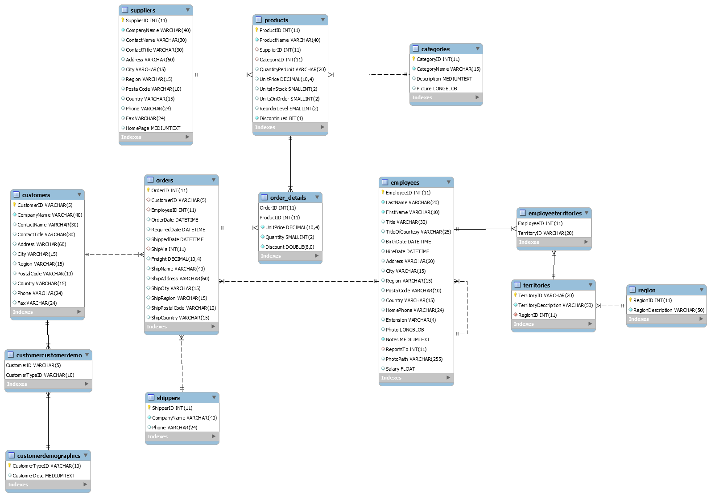

# Data warehouse design of Northwind database

Design a data warehouse of Northwind database. And use business analysis to get useful information.

### 1. Design of the logical and dimensional schema of the data warehouse / data mart (MySQL / MySQLWorkbench) :
+ #### 1.1. Analysis of business drivers and business objectives:
    

    Identify the factors that drive the business, these factors that change, affect the company in some manner.
    Thus they play a vital role in business decision, which may in turn give rise to more business requirements,
    and thus called business drivers.
    

    Here is our Business drivers and the corresponding Business objectives in the table below:
      

      
        |       Business drivers          |         Business objectives          |
        | ------------------------------- | ------------------------------------ |   
        |    Addition of new customers    |     Manage the increase in volume    |
        |  Addition/removal of products   |  Manage the change within the budget |
        |     Entry of new competitors    |          Customers retention         |
    

  
