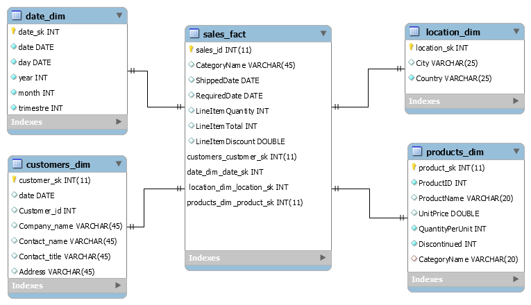

# Data warehouse design of Northwind database

Design a data warehouse of Northwind database. And use business analysis to get useful information.

#### 1. Design of the logical and dimensional schema of the data warehouse / data mart (MySQL / MySQLWorkbench) :
+ #### 1.1. Analysis of business drivers and business objectives:
    

    Identify the factors that drive the business, these factors that change, affect the company in some manner.
    Thus they play a vital role in business decision, which may in turn give rise to more business requirements,
    and thus called business drivers.
    

    Here is our Business drivers and the corresponding Business objectives in the table below:
      

      
        |       Business drivers          |         Business objectives          |
        | ------------------------------- | ------------------------------------ |   
        |    Addition of new customers    |     Manage the increase in volume    |
        |  Addition/removal of products   |  Manage the change within the budget |
        |     Entry of new competitors    |          Customers retention         |
  
    

+ #### 1.2. Identify key business processes:
    

        ????
    

+ #### 1.3. The key performance indicator:
    

        The quantifiable measurements that reflect the critical success factor of an organisation and help an organisation
        define and measure progress toward organizational goals.
    

     
    <b>A . Sales performance: </b>
    

      Measures the monthly sales amount with respect to the same month of the previous year the goal consists in achieving 15%
      for example growth year over year.
    

     
    <b>B . Number of orders: </b>
    

      Measures the activity in terms of orders received; it is computed as the number of orders submitted per month.
      And the goal is to achieve a 5% monthly increase for example.
    

    <b>C . Shipping efficiency : </b>
    

      Measures the delay in the shipping of orders, therefore, it is a measure of customers satisfaction.
    

+ #### 1.3. decision-making queries:

    

    <b style=" font-size:13.2pt;">1. Total sales amount per customer, year, and product category.</b>
    

    

    <b style=" font-size:13.2pt;">2. Yearly sales amount for each pair of customer country and supplier countries.</b>
    

    

    <b style=" font-size:13.2pt;">3. Monthly sales by customer state compared to those of the previous year.</b>
    

    

    <b style=" font-size:13.2pt;">4. Three best-selling employees.</b>
    

    

    <b style=" font-size:13.2pt;">5. Best-selling employee per product and year.</b>
    

    

    <b style=" font-size:13.2pt;">6. Total sales and average monthly sales by employee and year.</b>
    

  
+ #### 1.3. dimensional for the data warehouse / data mart:

+ #### 1.3. Estimate the size of the data mart / data warehouse:
    

    The size of the data warehouse is estimated by calculating the storage requirements of the designed table schema and the number
    of rows the database contains. The most important table to consider is the fact table as it requires the maximum amount of storage,
    and the space requirements of the dimension tables could be neglected in the estimation .
    

    

      Let us now estimate the size of the Sales_Fact table. The Sales_Fact table stores details of transactions by customers over a 
      period of 2.5 years. Let us assume that a customer has an average of 8 transactions per year.
    

    

  
      Customers = 91
      Average transaction per customer per year = 8
      year of Data = 2.5 years 
      Number of dimension = 4
      Other keys = 2
      Number of rows in the sales_fact = 91 * 8 * 2.5 = 1820
      Estimated Data size per row = (9 keys * 4 bytes ) + (1 nvarchar * 50) + (2 datetime * 8) + 
                                    (1 smallint * 2) + (1 money * 8) + (1 real * 4) = 116 bytes
    

    

      The sizes of the dimension tables can be estimated in a similar fashion. The actual
      size of the final data warehouse is 9.25 MB. The actual sizes of the different tables in the
      Northwind Data Warehouse
    

    

      The actual sizes of the different tables in the Northwind Data Warehouse are given in the table below:
    

        

  
          | ------------------ | ---------- | ---------------- | ---------------- | ---------------- |
          |       Table        |    Rows    |  Data Size (MB)  |  Index Size (MB) | Total Size (MB)  |
          | ---------------- - | ---------- | ---------------- | ---------------- | ---------------- |  
          |    Customer_Dim    |     91     |      0.023       |       0.016      |       0.039      |
          |    Product_Dim     |     77     |      0.016       |       0.016      |       0.032      |
          |    Time_Dim        |     708    |      0.266       |       0.016      |       0.282      |
          |    Location_Dim    |     124    |      0.008       |       0.008      |       0.016      | 
          |    Sales_Fact      |     1963   |      0.195       |       0.016      |       0.211      | 
          | ------------------ | ---------- | ---------------- | ---------------- | ---------------- |
  

#### 1. Pentaho Data Integration(PDI) :
+ #### 1.1. Time dimension:

+ #### 1.2. Location dimension:

+ #### 1.3. products dimension:

+ #### 1.3. customers dimension:

+ #### 1.3. Fact table:

